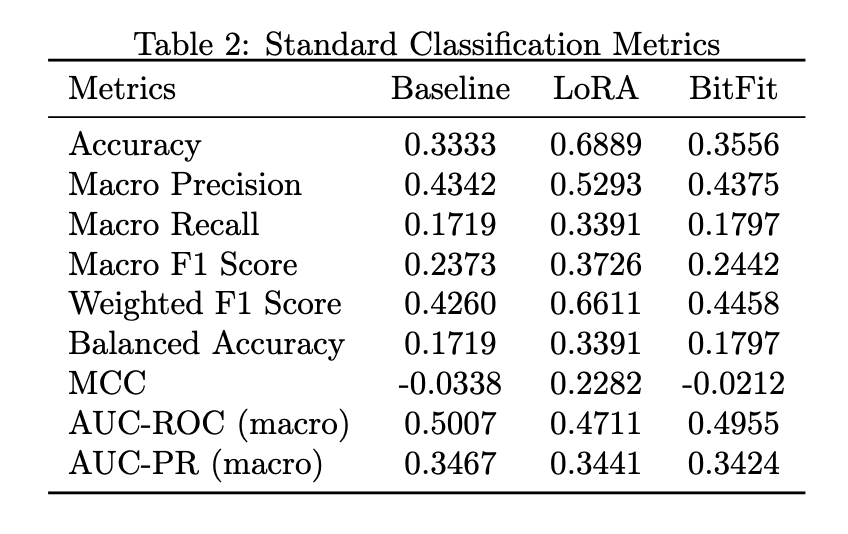

# PEFT-THYROID-LLAVA-MED

Title: Improving thyroid nodule classification with PEFT techniques on Medical LLMs

#### Dataset used:
- [DDTI: Thyroid Ultrasound Images](https://www.kaggle.com/datasets/dasmehdixtr/ddti-thyroid-ultrasound-images) 
- [Updated/Cleaned version](https://www.kaggle.com/datasets/ashkhagan/peft-thyroid-dataset/)

#### Base Model used:
- [LLaVA-Med](https://github.com/microsoft/LLaVA-Med)

#### Trained Weights:

#### Stages of the study for 244c
- Dataset finalization
- Baseline Establishment with LLaVA-MED
- Hyperparameter Testing
- PEFT Technique like LoRA, BitFit Training
- Technique Testing

#### Quick Start
Due to GPU VRAM constraints, We used kaggle for the entire project and below are the steps to run the notebooks which hosts the whole source.

#### Step 1: Git clone the source code
```
git clone https://github.com/ashwanirathee/peft-thyroid.git
```

### Step 2: Make kaggle login and upload the notebook
- Make a kaggle account and have a login
- Open a new notebook, upload any of these notebooks, add the datasets linked above for training purposes.
- and then use them like any usual Jupyter Notebook.

### Step 3: For running testing notebooks
- You'll need the BitFit and LoRa trained weights which are made available above too.
- Depending on the notebook, add the weights accordingingly. 


#### Results:



#### References:
- [LLaVA-Med](https://github.com/microsoft/LLaVA-Med)
- [MedTrinity-25M](https://github.com/UCSC-VLAA/MedTrinity-25M)